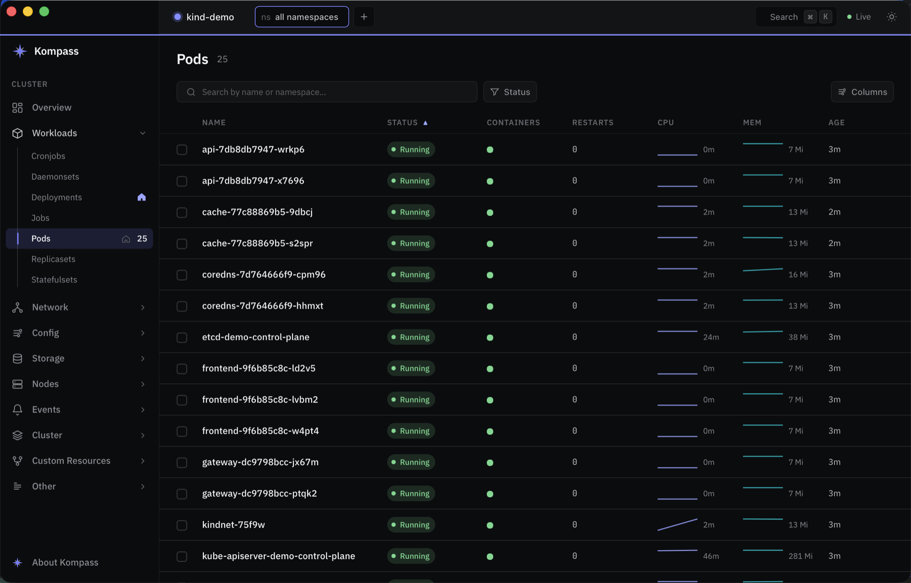

<div align="center">


# Kompass

**A beautiful, fast Kubernetes desktop app — built in Rust + Dioxus.**

Browse, inspect, and operate any cluster with a native, keyboard-driven UI that
stays responsive on clusters of any size.



</div>

---

## Why

Most Kubernetes UIs are either web dashboards that lag on large clusters or
heavyweight Electron apps. Kompass is a small native binary with a strict
architecture: **all cluster I/O runs on a background Tokio runtime**, and the
Dioxus UI thread only consumes deltas over a channel and renders from in-memory
state — so the interface never blocks on the network, even mid-reconnect.

## Features

**Browse everything**
- Generic, discovery-driven engine: every built-in kind **and CRDs**, grouped
  into a categorized sidebar (Workloads, Network, Config, Storage, Nodes,
  Events, Cluster, Custom Resources).
- Live `watch` with stale-while-revalidate caching and self-healing reconnects
  (refreshes expired credentials, e.g. `aws eks get-token`).
- Per-kind status mappers + a generic fallback; Lens-style per-container status
  squares (incl. init containers).
- Virtualized tables, column sorting (incl. **live CPU/Mem** with sparklines),
  per-kind column selection, fast debounced search — preserved per resource
  type and namespace view.

**Inspect**
- Resizable detail panel: **Summary**, **YAML** (syntax-highlighted, editable
  with search + match navigation), **Logs**, **Events**, and **Exec**.
- Logs: follow, wrap, include/exclude filters, inline match highlighting,
  **ANSI color** rendering, per-container selection, and merged multi-pod
  streams.
- Exec: an interactive terminal (xterm.js) into any container.

**Operate**
- Delete (with force delete), rollout restart, scale, cordon / drain,
  port-forward (with a global indicator).
- Confirmation for destructive actions on everything except pods.

**Multi-cluster & navigation**
- Cluster switcher with **pin-to-top**; per-cluster namespace views that persist
  across restarts.
- Detects namespace-scoped access (no cluster-wide list) and falls back to the
  one namespace you can read.
- Animated, progressively-loaded **Overview** dashboard (live).
- A settable **default boot page**.

**Crafted UI**
- Dual dark/light theme, oklch color system, per-cluster accent, IBM Plex Sans +
  JetBrains Mono, native macOS title-band integration.

### Keyboard

| Shortcut | Action |
|---|---|
| `⌘K` | Command palette (kinds, clusters, resources) |
| `⌘[` / `⌘]` | Navigate back / forward |
| `⌘R` | Refresh |
| `⌘F` / `⌘G` | Focus log/YAML search / next match |
| `⌘T` | New namespace view |

## Build & run

Requires a Rust toolchain and a working kubeconfig (`kubectl config
current-context`).

```sh
# Run against your current kube context
cargo run -p kompass-bin

# Run the test suite
cargo test
```

### macOS app bundle

```sh
./scripts/bundle.sh                  # release Kompass.app
./scripts/bundle.sh --debug --open   # debug build + launch
```

## Architecture

A two-crate workspace:

| Crate | Role |
|---|---|
| [`kompass-core`](crates/kompass-core) | UI-agnostic engine — connect, discover, watch, normalize into rows + deltas |
| [`kompass-bin`](crates/kompass-bin)   | Dioxus desktop app — Tokio↔UI bridge, all views |

The engine runs on its own Tokio runtime and streams `Delta`s to the UI over an
unbounded channel; the UI sends `Cmd`s back. See
[`ARCHITECTURE.md`](ARCHITECTURE.md) and [`DESIGN_SPEC.md`](DESIGN_SPEC.md).

**Built with** [Rust](https://www.rust-lang.org) ·
[Dioxus](https://dioxuslabs.com) · [kube-rs](https://kube.rs) ·
[Tokio](https://tokio.rs) · [xterm.js](https://xtermjs.org).

## License

MIT.

---

<div align="center">
Made with ♥ by <a href="https://github.com/erango">@erango</a>
</div>
